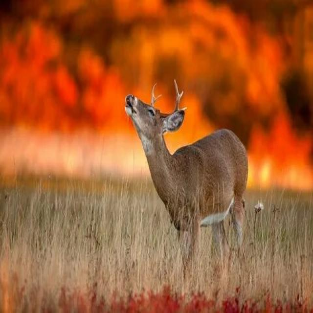
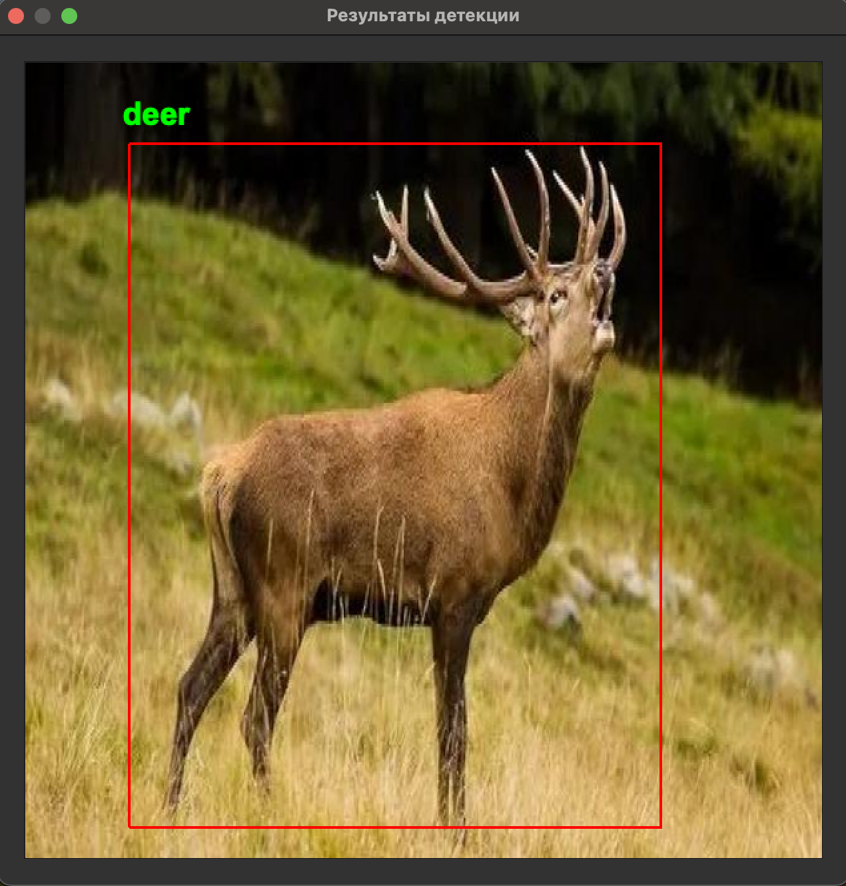
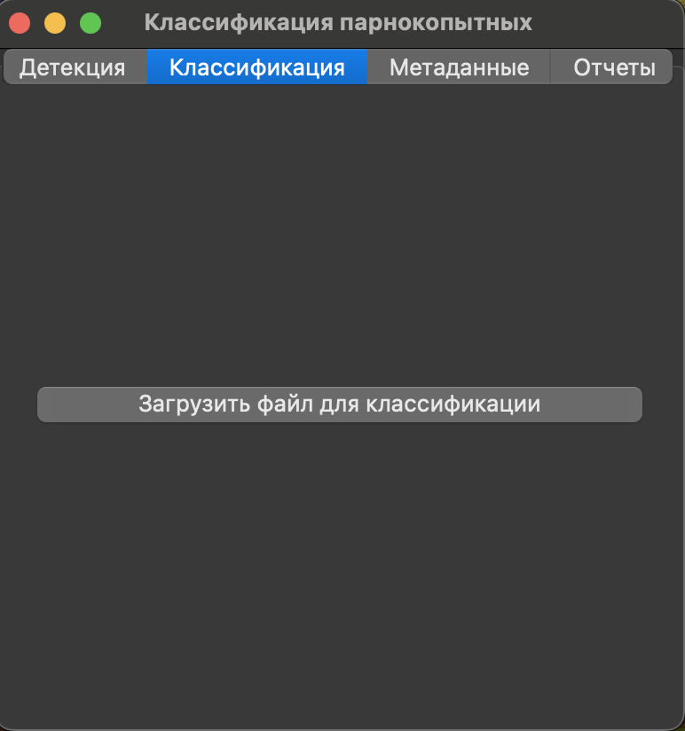
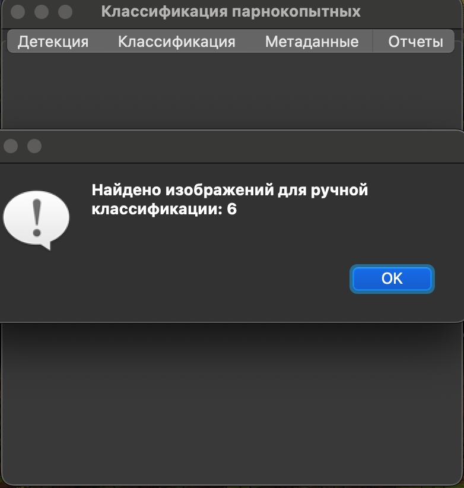
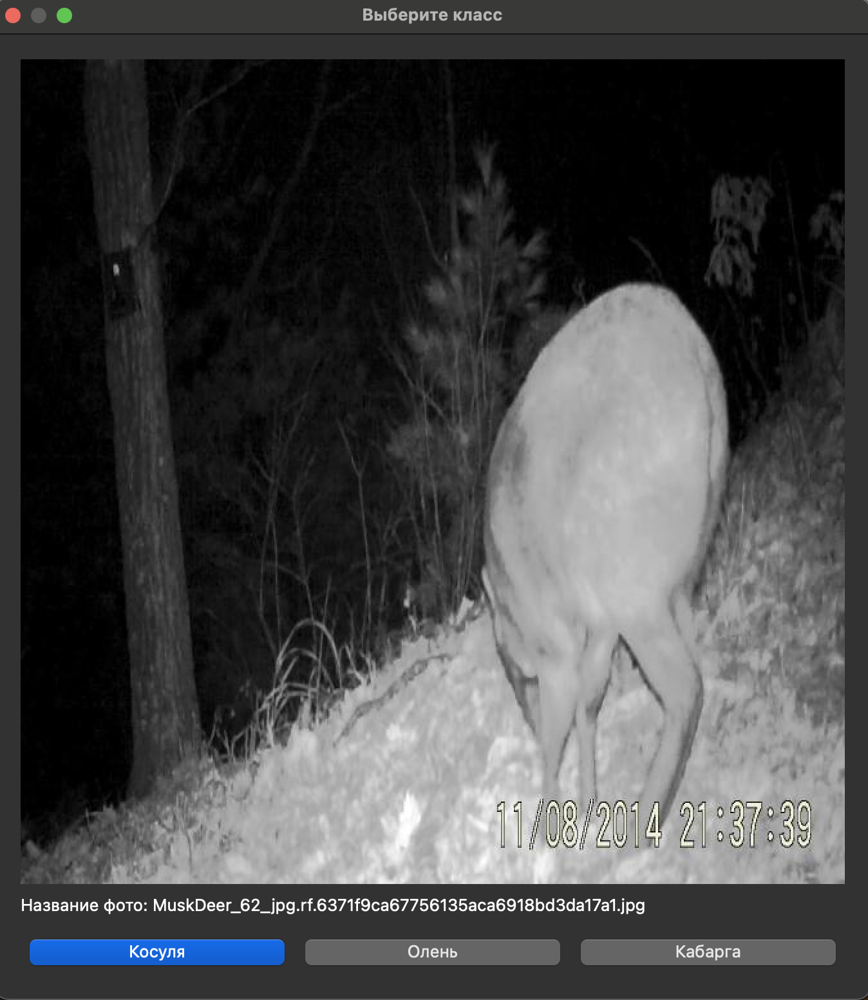
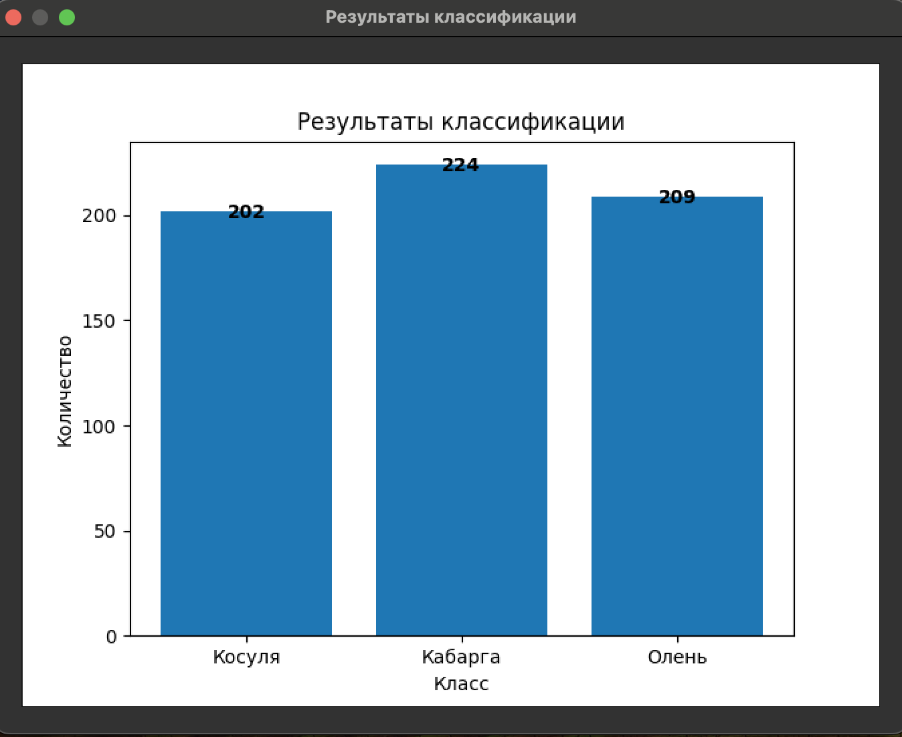
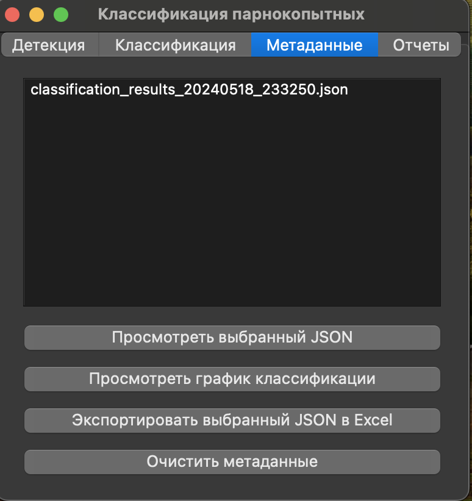
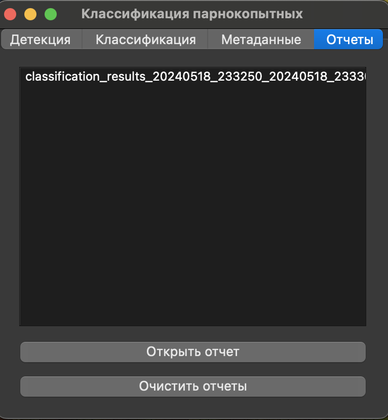

# Классификация и детекция парнокопытных
  Репозиторий команды Уральские Мандарины для хакатона Цифровой прорыв. Кейс классификация парнокопытных

<p align="left">
  
</p>

## Обзор
**animal_detection_hack** — это приложение, предназначенное для детекции и классификации изображений парнокопытных животных, в частности оленей, косуль и кабарг. Используя передовые модели машинного обучения, это приложение обеспечивает точные и эффективные результаты классификации и детекции.

## Особенности

- **Детекция изображений**: Обнаруживает парнокопытных животных на изображениях и рисует вокруг них рамки.
- **Классификация изображений**: Классифицирует изображения парнокопытных животных на три категории: Олень, Косуля и Кабарга.
- **Ручная классификация**: Позволяет вручную классифицировать изображения с неопределенными вероятностями.
- **Подробные отчеты**: Генерирует подробные отчеты о результатах классификации.

## Архитектура модели

Для детекции использована модель YoloWorld (https://www.yoloworld.cc/). Модель YoloWorld является одним из самых современных решений для задач детекции объектов. Она обеспечивает высокую точность и производительность, что делает ее идеальной для детекции парнокопытных животных.

### Преимущества YoloWorld

- **Высокая точность**: YoloWorld способна обнаруживать объекты с высокой точностью благодаря своей архитектуре и методам обучения.
- **Быстрая производительность**: Модель оптимизирована для быстрого выполнения, что позволяет использовать ее в реальном времени на видео и изображениях.
- **Гибкость**: YoloWorld поддерживает различные конфигурации и параметры, что позволяет адаптировать ее для различных задач и условий.

## Установка

### Ссылка на exe приложение
https://drive.google.com/file/d/1DZTxamfCix_vY81n71okRywocpEnM62C/view?usp=sharing

### Ссылка на модели
https://drive.google.com/file/d/15HSl6eTC-8VHq8v0s83o1tfy9pY631iy/view?usp=sharing

### Требования

- Python 3.10.11
- Poetry (для управления зависимостями)
- Make (для автоматизации сборки)

### Шаги установки

1. **Клонирование репозитория**

    ```sh
    git clone https://github.com/RomanLazovskiy/animal_detection_hack.git
    cd animal_detection_hack
    ```

2. **Настройка виртуального окружения и установка зависимостей**

    ```sh
    make venv
    ```

3. **Запуск приложения**

    ```sh
    make run
    ```

### Дополнительные команды Make

- **Сборка приложения в исполняемый exe файл **

    ```sh
    make build
    ```

- **Очистка сборки и временных файлов**

    ```sh
    make clean
    ```

- **Обновление зависимостей**

    ```sh
    make update-deps
    ```

- **Помощь**

    ```sh
    make help
    ```

## Структура репозитория

```plaintext
animal_detection_hack/
├── backend/ # Логика бэкенда и инференс модели
│ ├── init.py
│ ├── inference.py # Функции инференса для детекции и классификации
│ │
├── models/ # Папка с моделями
│ ├── best_clasify.pt Модель для классификации
│ │── best_detect.pt Модель для детекции
│ │
├── docs/ # Документация и изображения
│ ├── images/ Папка для изображений из документации
│ │
├── gui/ # Компоненты GUI
│ ├── init.py
│ ├── app.py # Главный файл приложения
│ ├── tabs/ Папка со всеми формами для окон
│ │    │ ├── init.py Инициализация пакета.
│ │    │ ├── classification_tab.py Вкладка для классификации изображений.
│ │    │ ├── classification_dialog.py Диалоговое окно для ручной классификации изображений.
│ │    │ ├── detection_tab.py Вкладка для детекции объектов на изображениях и видео.
│ │    │ ├── metadata_tab.py Вкладка для управления метаданными.
│ │    │ ├── reports_tab.py Вкладка для отображения отчетов.
│ │ 
├── utils/ # Вспомогательные функции
│ ├── init.py
│ ├── display.py # Функции для отображения изображений и графиков
│ ├── file_operations.py # Функции для работы с файлами
│ ├── logger.py # Конфигурация логгера
│ │ 
├──  tests
│ ├── test.py Файл для тестирования
│ 
├── Makefile # Makefile для автоматизации сборки
├── pyproject.toml # Конфигурационный файл Poetry
├── poetry.lock # Файл с метаданными зависимостей Poetry
├── app.spec # Конфигурационный файл для pyinstaller
├── README.md # Файл README
```

## Использование

## Детекция изображений

### Загрузите файл изображения для детекции. Приложение обнаружит и нарисует рамки вокруг обнаруженных парнокопытных животных.



## Классификация изображений

### Загрузите файлы изображений для классификации. Приложение классифицирует изображения в одну из трех категорий: Олень, Косуля и Кабарга.



## Уведомление о необходимости ручной классификации

### Если необходимо вручную определить класс.



## Ручная классификация

### Если вероятность классификации попадает в определенный диапазон, приложение предложит пользователю вручную классифицировать изображение.



## График классификации

### После классификации можно посмотреть интерактивный график с распределением по классам



## Метаданные

### После классификации приложение генерирует метаданные по классификации.



## Отчеты

### После классификации приложение генерирует отчет, суммирующий результаты.



# С уважением ваши Уральские Мандарины!
<p align="left">
  
</p>